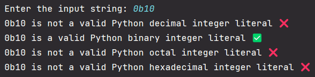
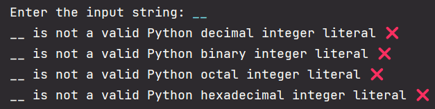
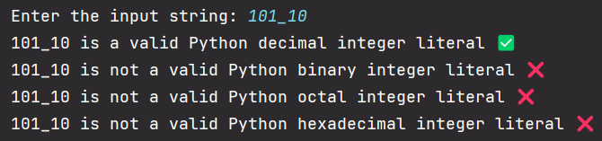
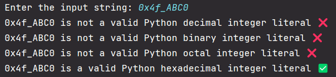

# CS3110Project1
Project 1 for CS 3110

Team ∅ members:
- Phu Truong
- Amar Gandhi
- Nich Rosen

## ⚙️ Installation

Clone the git repo:

`git clone https://github.com/Pnutru/CS3110Project1`

## 🧑‍💻 Usage

1. CD into project directory:

    `cd CS3110Project1`

1. Run the program:

    `python CS3110Project1.py`

1. The program will then prompt you for input. Enter an input, to which the program will respond valid or not valid.

## 🖼️ Program Run Screenshots

